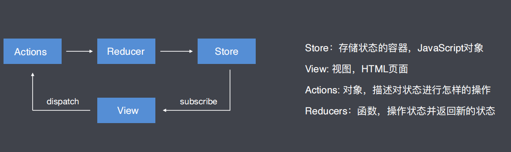
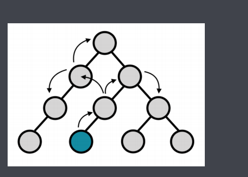
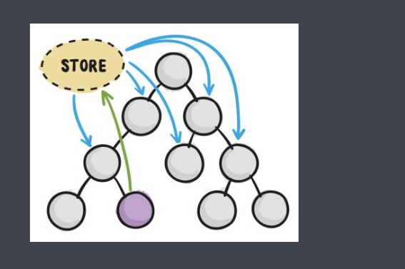
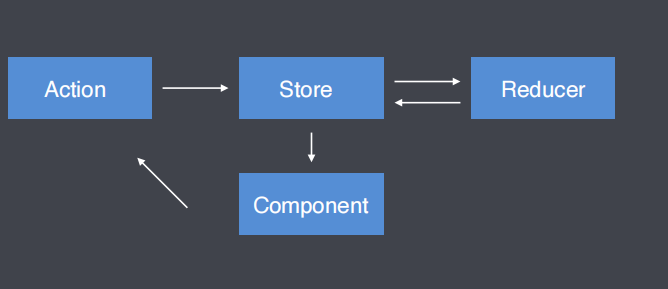
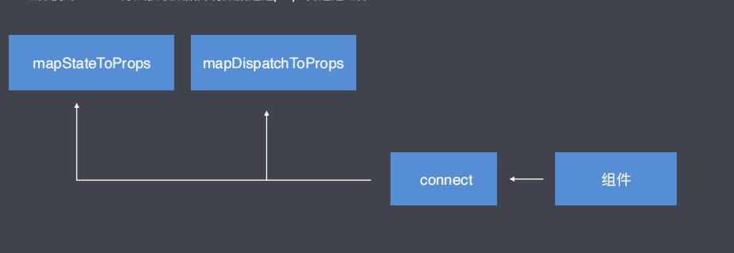
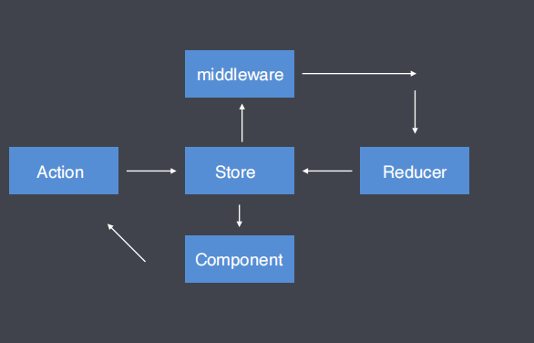

# 1. redux

# 2 Redux 核心
## 2.1 Redux 介绍
js状态容器，提供可预测化的状态管理

## 2.2 获取 redux
官网  CDN
``` html
<script src="https://cdn.bootcss.com/redux/4.0.5/redux.min.js">
```

## 2.3 redux 核心概念及工作流程



## 2.4 redux 核心 API
``` js
// 创建store容器
const store =  Redux.createStore(reducer)
// 创建用于处理状态的 reducer 函数
function reducer (state = initialState, action) {}
// 获取状态
store.getState()
// 订阅状态
store.subscribe(function(){console.log("状态更新触发")})
// 触发Action
store.dispatch({type: 'action'})
```

# 3 React + Redux
## 3.1 在 react 中不使用 redux 时遇到的问题
在React中组件通信的数据流是单向的, 顶层组件可以通过props属性向下层组件传递数据, ⽽下层组件不能向上层组件传递数据, 要实现下层组件修改数据, 需要上层组件传递修改数据的⽅法到下层组件. 当项⽬越来越⼤的时候, 组件之间传递数据变得越来越困难.



## 3.2 在 react 项目中加入 redux 的好处
使用 redux 管理数据，由于 store 独立于组件，使得数据管理独立于组件，解决了组件与组件之间传递数据困难的问题。



## 3.3 下载 redux
``` sh
npm install redux react-redux
```

## 3.4 redux 工作流程
1. 组件通过 dispatch ⽅法触发 Action 
2. Store 接收 Action 并将 Action 分发给 Reducer 
3. Reducer 根据 Action 类型对状态进⾏更改并将更改后的状态返回给 Store 
4. 组件订阅了Store中的状态，Store中的状态更新会同步到组件



## 3.5 redux 使用步骤

### 3.5.1 创建 Store 和 Reducer
1. 创建 Store 需要使⽤ createStore ⽅法, ⽅法执⾏后的返回值就是Store, ⽅法需要从 redux 中引⼊
2. createStore ⽅法的第⼀个参数需要传递reducer 
3. reducer 是⼀个函数, 函数返回什么, store中就存储什么. 函数名称⾃定义.
``` js
import { createStore } from "redux"
const store = createStore(reducer);
function reducer (){
    return { count: 1 }
}
```

### 3.5.2 组件获取Store中的数据 
Provider 组件与 connect ⽅法

1. 将store中的数据放在Provider组件中, Provider组件是存储共享数据的地⽅
``` js
import { Provider } from "react-redux"
import store from "./store";
ReactDOM.render(<Provider store={store}><App/></Provider>);
```

2. 组件使⽤connect⽅法获取数据并将数据通过props传递进组件



``` js
import { connect } from "react-redux"
const mapStateToProps = state => ({
    count: state.count
})
export default connect(mapStateToProps)(组件名称)
```

### 3.5.3 组件更改Store中的数据
1. 定义 action  
- action是改变状态的唯⼀途径
``` js
const action = {type: "描述对数据要进行什么样的操作"}
```

2. 组件触发 action
``` js
this.props.dispatch({type: "描述对数据要进行什么样的操作"})
```

3. reducer 接收 action, 针对action对数据进⾏处理并返回
``` js
const initialState = { count: 0 }
const reducer = (state = initialState,action)=>{
    switch(action.type){
        case "描述对数据要进行什么样的操作":
            return { count: state.count + 1}
        default:
            return state;
    }
}
```
### 3.5.4 为 action 传递参数
1. 传递参数
``` js
<button onClick={()=> increment(1)}>+1</button>
```
2. 接收参数, 传递reducer
``` js
export const increment = payload => ({type: INCREMENT, payload})
```
3. reducer根据接收到的数据进⾏处理
``` js
export default (state, action) => {
    switch(action.type){
        case INCREMENT:
            return { count: state.count + action.payload }
    }
}
```

## 3.6 优化
### 3.6.1 使⽤ Action Creator 函数将触发Action的代码独⽴成函数

在组件中通过调⽤this.props.dispatch({type: '描述对数据进⾏设么样的操作'})⽅法触发action. 造成HTML模板在视觉上的混乱.

``` js
const { increment, decrement, count } = this.props
<button onClick={increment}>+1</button>
<span>count<span>
<button onClick={decrement}>+1</button>
```

``` js
const mapDispatchToProps = dispatch =>{
    increment(){
        dispatch({ type: INCREMENT})
    }
    decrement(){
        dispatch({ type: DECREMENT})
    }
}
export default connect(mapStateToProps, mapDispatchToProps)(组件名称)
```

### 3.6.2 Action Creators 函数绑定      bindActionCreators
触发Action的函数, 内部代码重复率⾮常⾼, 所以React提供了⽅法帮我们⽣成这些函数, 代替开发者⼿写.

``` js
// store/actions/counter.actions.js
export const increment = () => ({ type: INCREMENT })
export const decrement = () => ({ type: DECREMENT })
// 组件
import { bindActionCreators } from "redux"
import * as counterActions from "../store/actions/counter.action"
const mapDispatchToProps = dispatch =>({
    ...bindActionCreators(counterActions, dispatch)
})
```

### 3.6.3 将Action类型字符串独⽴成常量
Action类型字符串组件在触发Action时需要使⽤, Reducer在接收Action时也需要使⽤, 由于字符串不存在代码提示, 存在写错的⻛险, 所以要将它独⽴成常量.
``` js
const INCREMENT = "increment"
const DECREMENT = "decrement"
```

### 3.6.4 拆分Reducer       combineReducers
当要管理的数据越来越多时, reducer中的代码将会变得越来越庞⼤. 
React允许将⼀个⼤的reducer拆分成若⼲个⼩的reducer, 最后进⾏合并使⽤.
``` js
import { combineReducers } from "redux"
import counterReducer from "./counter.reducer.js"
import userReducer from "./user.reducer.js"
// { counter: {counter: 0}, user: {name: "张山",age: 20} }
export default combineReducers({
    counter: counterReducer,
    user: userReducer
})
```

# 4 Redux 中间件
## 4.1 什么是中间件?
中间件允许我们扩展redux应用程序

## 4.2 加入了中间件 redux 工作流程图



## 4.3 开发 redux 中间件
开发中间件的模板代码

``` js
export default store => next => action => {}
```

## 4.4 注册中间件
中间件在开发完成以后只有被注册才能在Redux的⼯作流程中⽣效

``` js
import { createStore, applyMiddleware } from "redux"
import reducer from "./reducer"
import logger from "./middleware/logger"
export default createStore(reducer, applyMiddleware(logger))
```

## 4.5 中间件开发实例   thunk
thunk 中间件可以让我们在 Redux 的⼯作流程中加⼊异步代码
``` js
export default ({dispatch,getState}) => next => action =>{
    if(type action === "function"){
        return action(dispatch, getState)
    }
    next(action)
}
```

# 5 Redux 常用中间件
## 5.1 redux-thunk
### 5.1.1 redux-thunk 下载
npm install redux-thunk

### 5.1.2 引入 redux-thunk
``` js
import thunk from "redux-thunk"
```
### 5.1.3 注册 redux-thunk
``` js
import { createStore, applyMiddleware } from "redux"
import thunk from "redux-thunk"
import rootReducer from "./reducer"
createStore( rootReducer, applyMiddleware(thunk) )
```
### 5.1.4 使用 redux-thunk 中间件
``` js
import axios from "axios"
const loadPosts = () => async dispatch =>{
    const posts = await axios.get("/api/posts").then(response =>response.data);
    dispatch({ type: LOADPOSTSSUCCESS, palyload: posts })
}
```

## 5.2 redux-saga
### 5.2.1 redux-saga 解决的问题
redux-saga 可以将异步操作从 Action Creator ⽂件中抽离出来，放在⼀个单独的⽂件中.
### 5.2.2 redux-saga 下载
``` js
npm install redux-saga
```
### 5.2.3 创建 redux-sage 中间件
``` js
import createSagaMiddleware from "redux-saga"
const sagaMiddleware = createSagaMiddleware()
```
### 5.2.4 注册 sagaMiddleware 中间件
``` js
createStore(reducer, applyMiddleware(sagaMiddleware))
```
### 5.2.5 使用 saga 接受 action 执行异步操作
``` js
import { takeEvery, put } from "redux-saga/effects"
import axios from "axios"
function* load_posts(){
    // 异步获取json数据
    const {data} = yield axios.get("/api/posts.json")
    // 把data交给另外一个action处理
    yield put(load_posts_success(data))
}
export default function* postSaga(){
    // 当触发action为LOAD_POSTS方法时，触发load_posts方法
    yield takeEvery(LOAD_POSTS, load_posts)
}
```
### 5.2.6 启动 saga
``` js
import { createStore } from "redux"
import createSagaMiddleware from "redux-saga"
import postSaga from "./store/sagas/post.saga"
// 创建 redux-saga 中间件
const sagaMiddleware = createSagaMiddleware()
// 注册 sagaMiddleware 中间件
createStore(reducer, applyMiddleware(sagaMiddleware))
// 启动 saga
sagaMiddleware.run(postSaga)
```

### 5.2.7 合并 sagas
``` js
// store/root.saga
import { all } from "redux-saga/effects"
import counterSaga from "./counte.saga"
import postSaga from "./post.saga"
export default function* rootSaga(){
    yield all([
        counterSaga(),
        postSaga()
    ])
}
// store/index.js
import { createStore } from "redux"
import createSagaMiddleware from "redux-saga"
import rootSaga from "./root.saga"
// 创建 redux-saga 中间件
const sagaMiddleware = createSagaMiddleware()
// 注册 sagaMiddleware 中间件
createStore(reducer, applyMiddleware(sagaMiddleware))
// 启动 saga
sagaMiddleware.run(rootSaga)
```

## 5.3 redux-actions
### 5.3.1 redux-actions 解决的问题
redux流程中⼤量的样板代码读写很痛苦, 使⽤redux-actions可以简化Action和Reducer的处理

### 5.3.2 redux-actions 下载
``` js
npm install redux-actions
```

### 5.3.3 创建 Action
``` js
import { createAction } from "redux-actions"
const increment_action = createAction("increment")
const decrement_action = createAction("decrement")
```

### 5.3.4 创建 reducer
``` js
import { handleAction as createReducer } from "redux-actions"
import { increment_action, decrement_action } from "../actions/counter.action"
// state 初始值
const initialState = { count: 0}
// 创建 reducer
const counterReducer = createReducer({
    [increment_action]: (state,action)=> ({count: state.count+1}),
    [decrement_action]: (state,action)=> ({count: state.count-1})
}, initialState)
// 返回 reducer
export default counterReducer
```

# 6 Redux 综合案例

## 6.1 项目初始化

## 6.2 搭建 redux 工作流

## 6.3 商品列表数据展示

## 6.4 加入商品到购物车

## 6.5 购物车列表数据展示

## 6.6 从购物车中删除商品

## 6.7 更改购物车中商品数量

## 6.8 更正视图中图片显示错误

## 6.9 计算商品总价

# 7. redux 源码之核心逻辑
## 7.1 redux 源码之类型约束

## 7.2 redux 源码之 Enhancer

## 7.3 redux 源码之 applyMiddleware

## 7.4 redux 源码之 bindActionCreators

## 7.5 redux 源码之 combineReducers